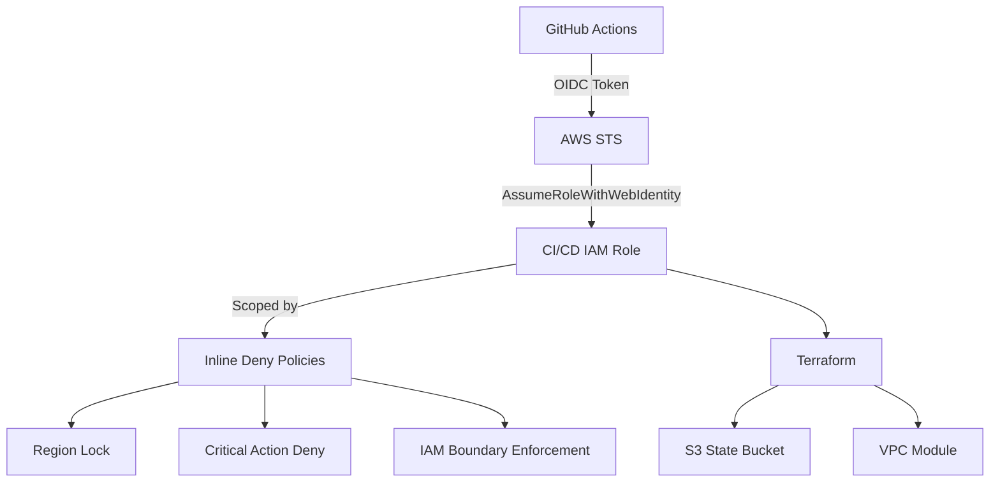
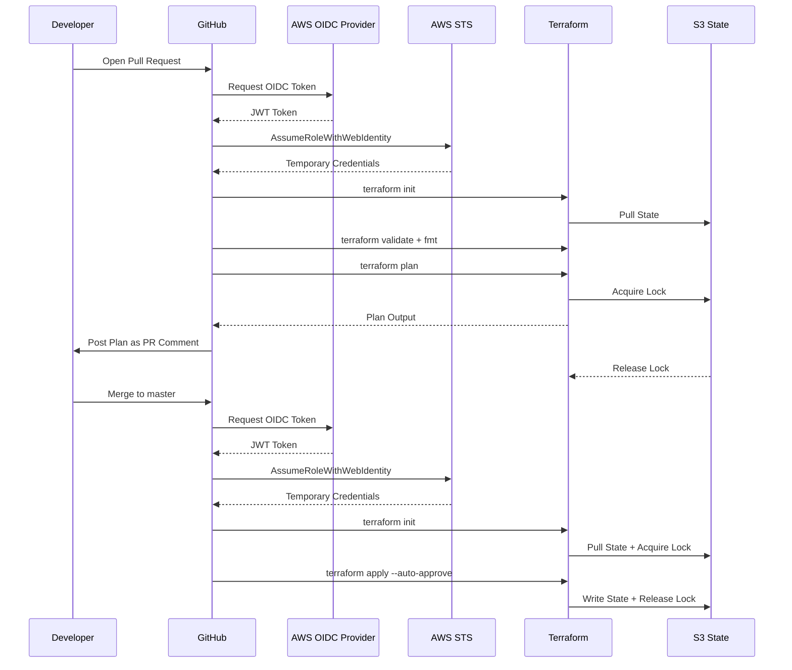
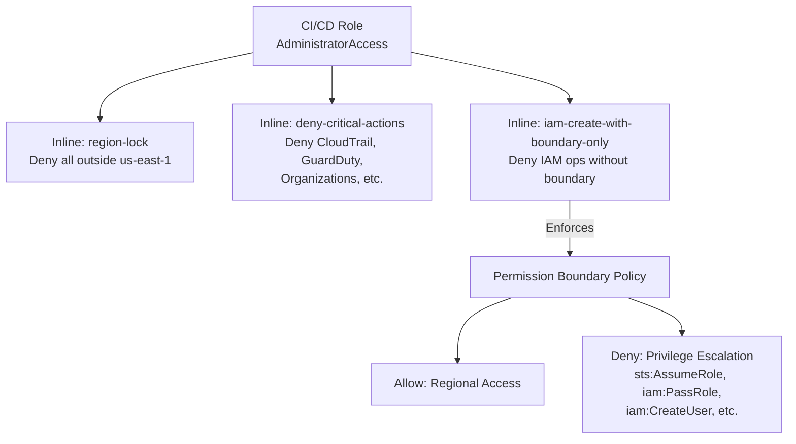
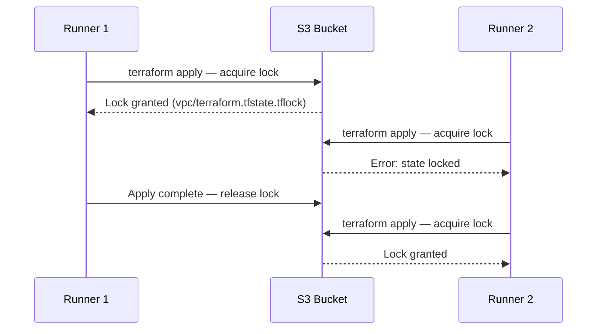

# Terraform CI/CD Pipeline

A production-grade AWS infrastructure pipeline using GitHub Actions OIDC authentication,
S3 state management, and permission boundary enforcement.

---

## Table of Contents

- [Architecture](#architecture)
- [Repository Structure](#repository-structure)
- [Prerequisites](#prerequisites)
- [Bootstrap](#bootstrap)
- [CI/CD Pipeline](#cicd-pipeline)
- [Security Model](#security-model)
- [State Management](#state-management)
- [Modules](#modules)
- [Validation](#validation)

---

## Architecture

### Infrastructure Overview



### CI/CD Flow



### IAM Permission Model



### State Locking



---

## Repository Structure

```
.
├── .github/
│   └── workflows/
│       ├── ci.yml                      # Plan on pull request
│       └── cd.yml                      # Apply on merge to master
├── backend/                            # S3 state bucket bootstrap
│   ├── aws_s3_bucket.tf
│   ├── locals.tf
│   ├── outputs.tf
│   ├── variables.tf
│   └── versions.tf
├── terraform_ci_cd_pre_req/            # OIDC + IAM role bootstrap
│   ├── aws_iam_boundary.tf
│   ├── aws_iam_oidc.tf
│   ├── aws_iam_role.tf
│   ├── locals.tf
│   ├── outputs.tf
│   ├── variables.tf
│   ├── versions.tf
│   └── github_secrets.sh               # Bootstrap GitHub secrets
├── main.tf                             # VPC module
├── outputs.tf
├── variables.tf
├── versions.tf
└── validaton_script.sh                 # OIDC setup validator
```

---

## Prerequisites

- Terraform >= 1.10.0
- AWS CLI configured with credentials that can bootstrap IAM and S3
- GitHub CLI (`gh`) authenticated via `gh auth login`
- An existing GitHub repository

---

## Bootstrap

Bootstrap must be run once in order. Each step depends on the previous.

### Step 1 — Provision the S3 State Bucket

```bash
cd backend
terraform init
terraform apply
```

Note the `s3_bucket_id` output. Update the `bucket` value in
`terraform_ci_cd_pre_req/versions.tf` and root `versions.tf` if it differs
from the auto-generated name.

### Step 2 — Provision the OIDC Provider and CI/CD Role

```bash
cd terraform_ci_cd_pre_req
terraform init
terraform apply
```

Key outputs:

| Output | Description |
|--------|-------------|
| `cicd_role_arn` | IAM role for GitHub Actions to assume |
| `oidc_provider_arn` | GitHub OIDC provider ARN |
| `boundary_policy_arn` | Permission boundary ARN |
| `github_subject_claim` | Exact subject claims locked to your repo and branch |

### Step 3 — Bootstrap GitHub Secrets

Run from the `terraform_ci_cd_pre_req` directory so the script can read
Terraform outputs directly:

```bash
./github_secrets.sh -o <github-org> -r <repo-name>
```

This will:
- Obtain or reuse a cached GitHub PAT via the `gh` CLI
- Read `cicd_role_arn` from Terraform outputs
- Set `AWS_ROLE_ARN` as a GitHub Actions secret
- Set `AWS_REGION` and `ENVIRONMENT` as GitHub Actions variables

### Step 4 — Validate the Setup

```bash
cd terraform_ci_cd_pre_req
bash ../validaton_script.sh
```

All 34 checks should pass before proceeding.

---

## CI/CD Pipeline

### CI — Pull Request

Triggered on every pull request targeting `master`.

```
Checkout
  → Configure AWS credentials (OIDC)
    → Terraform Init
      → Format Check
        → Validate
          → Plan
            → Post plan output as PR comment
```

- Format check failures are non-blocking but reported in the PR comment.
- Plan failures block the PR via an explicit `exit 1` after the comment is posted,
  ensuring the comment is always visible regardless of plan outcome.

### CD — Apply

Triggered on push to `master` (merge) and `workflow_dispatch`.

```
Checkout
  → Configure AWS credentials (OIDC)
    → Terraform Init
      → Validate
        → Apply --auto-approve
```

State is locked in S3 for the duration of the apply. Concurrent applies will
fail with a lock error rather than corrupt state.

---

## Security Model

### OIDC Authentication

No long-lived AWS credentials are stored in GitHub. The CI/CD role is assumed
via GitHub's OIDC provider using short-lived tokens scoped to a specific
repository and branch.

Trust policy is restricted to:
- `repo:<org>/<repo>:ref:refs/heads/<branch>` — push events on the configured branch
- `repo:<org>/<repo>:pull_request` — pull request events

### IAM Role Constraints

The CI/CD role has `AdministratorAccess` attached but is constrained by three
inline deny policies that cannot be overridden by any allow policy:

| Policy | Purpose |
|--------|---------|
| `region-lock` | Denies all actions outside the configured AWS region |
| `deny-critical-actions` | Denies irreversible account-level actions |
| `iam-create-with-boundary-only` | Denies IAM user/role creation without a permission boundary |

### Permission Boundary

All IAM users and roles created by the CI/CD role must have the
`terraform-created-users-boundary` policy attached as a permission boundary.
This boundary denies privilege escalation paths including `sts:AssumeRole`,
`iam:PassRole`, and `iam:CreateAccessKey`.

The boundary also enforces regional scope using `StringEqualsIfExists` to
allow global services (IAM, S3, STS) while blocking regional actions outside
the configured region.

---

## State Management

State is stored in S3 with native locking (Terraform >= 1.10.0 required).

| Module | State Key |
|--------|-----------|
| `backend/` | local (bootstraps the bucket) |
| `terraform_ci_cd_pre_req/` | `oidc/terraform.tfstate` |
| Root (VPC) | `vpc/terraform.tfstate` |

S3 bucket configuration:
- Versioning enabled
- AES256 server-side encryption
- SSL-only bucket policy
- Public access blocked
- Native state locking via `.tflock` files (no DynamoDB required)

---

## Modules

### backend

Provisions the S3 bucket used for remote state. Manages its own local state
and is applied once before all other modules.

### terraform_ci_cd_pre_req

Provisions the GitHub OIDC provider and CI/CD IAM role with all associated
inline policies and permission boundary. Applied once during initial setup.

Variables:

| Variable | Description | Default |
|----------|-------------|---------|
| `github_org` | GitHub organization or username | required |
| `github_repo` | GitHub repository name | required |
| `github_branch` | Branch allowed to assume the role | `master` |
| `environment` | Environment name | `development` |
| `short_name` | Short prefix for resource naming | `samproj` |

### Root (VPC)

Provisions a VPC with public and private subnets across multiple availability
zones, internet gateway, NAT gateways, and route tables.

Variables:

| Variable | Description | Default |
|----------|-------------|---------|
| `vpc_cidr` | VPC CIDR block | `10.0.0.0/16` |
| `availability_zones` | List of AZs | `["us-east-1a", "us-east-1b"]` |
| `public_subnet_cidrs` | Public subnet CIDRs | `["10.0.1.0/24", "10.0.2.0/24"]` |
| `private_subnet_cidrs` | Private subnet CIDRs | `["10.0.10.0/24", "10.0.11.0/24"]` |

---

## Validation

The validation script runs 34 checks against the live AWS environment,
verifying policy content, condition keys, and simulating key deny scenarios
using `iam:SimulatePrincipalPolicy`.

```bash
cd terraform_ci_cd_pre_req
bash ../validaton_script.sh
```

Checks include:

- OIDC provider existence and audience claim
- Role trust policy and session duration
- All inline policy content and condition operators
- Boundary policy regional scope and escalation denials
- Live policy simulation for region lock, critical denies, and boundary enforcement
